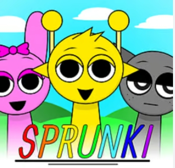

# Sprunki Kiss: A Fun and Exciting Game for Everyone

## Introduction

Have you ever heard of the game called **Sprunki Kiss**? If not, you’re in for a treat! Sprunki Kiss is a super fun and exciting game that people of all ages can enjoy. Whether you’re a kid, a teenager, or even an adult, this game will keep you entertained for hours. In this article, we’re going to explore everything about Sprunki Kiss, from how to play it to why it’s so popular. So, let’s dive right in!

**👉👉 Click to play*: [Sprunki Kiss](https://sprunkikissedition.pages.dev) 

## What is Sprunki Kiss?

Sprunki Kiss is a video game that combines elements of adventure, puzzle-solving, and strategy. It’s set in a magical world filled with colorful characters, mysterious places, and exciting challenges. The main goal of the game is to help the main character, Sprunki, navigate through different levels, solve puzzles, and defeat enemies to save the day.

The game is available on multiple platforms, including PC, consoles, and mobile devices, so you can play it wherever you are. It’s designed to be easy to pick up but hard to master, which means anyone can start playing quickly, but it will take time and practice to become really good at it.

## The Story of Sprunki Kiss

Every great game has an interesting story, and Sprunki Kiss is no exception. The game takes place in a magical land called **Kisslandia**, where peace and harmony have been disrupted by an evil sorcerer named **Darkulon**. Darkulon has cast a spell on the land, causing chaos and confusion everywhere.

The main character, **Sprunki**, is a brave and clever little creature who has been chosen to save Kisslandia. Sprunki has a special power: the ability to plant magical kisses that can heal, protect, and even defeat enemies. With the help of friends and allies, Sprunki must travel through different regions of Kisslandia, solve puzzles, and defeat Darkulon’s minions to restore peace to the land.

## Gameplay

### Controls

The controls in Sprunki Kiss are simple and easy to learn. On a PC or console, you use the arrow keys or joystick to move Sprunki around. You can also use buttons to perform actions like jumping, planting kisses, and interacting with objects. On a mobile device, you use touch controls to move and perform actions.

### Levels and Challenges

Sprunki Kiss is divided into different levels, each with its own unique challenges. In each level, you need to navigate through obstacles, solve puzzles, and defeat enemies to progress. Some levels are more about exploration, while others are more about combat and strategy.

The puzzles in the game are really fun and can range from simple to complex. For example, you might need to figure out how to open a locked door by finding a hidden key or solve a riddle to unlock a treasure chest. The game also has boss battles, where you face off against powerful enemies that require strategy and quick thinking to defeat.

### Power-Ups and Collectibles

As you play through the game, you can collect various power-ups and items that help Sprunki on the journey. Some power-ups give Sprunki temporary abilities, like increased speed or invincibility. Others are collectibles that you can use to unlock special features or bonus content.

There are also hidden items and secrets scattered throughout the levels, so exploration is encouraged. Finding these hidden treasures can give you an edge in the game and make it easier to progress.

### Multiplayer Mode

One of the coolest features of Sprunki Kiss is its multiplayer mode. In this mode, you can team up with friends or other players online to tackle challenges together. Working as a team can make it easier to solve puzzles and defeat enemies, and it’s a great way to have fun with friends.

## Graphics and Sound

### Visuals

The graphics in Sprunki Kiss are bright, colorful, and full of detail. The world of Kisslandia is beautifully designed, with each region having its own unique look and feel. From lush forests to icy mountains, the game’s environments are a joy to explore.

The characters in the game are also well-designed and full of personality. Sprunki is adorable and expressive, and the enemies are creative and sometimes even a little scary. The animations are smooth and fluid, making the gameplay experience even more enjoyable.

### Music and Sound Effects

The music in Sprunki Kiss is catchy and fits perfectly with the game’s magical theme. Each region has its own background music that sets the mood and enhances the gameplay experience. The sound effects are also well-done, from the sound of Sprunki’s footsteps to the magical whoosh of a planted kiss.

## Why is Sprunki Kiss So Popular?

### Fun for All Ages

One of the reasons Sprunki Kiss is so popular is that it’s fun for players of all ages. Kids love the colorful graphics and simple controls, while older players enjoy the challenging puzzles and strategic gameplay. It’s a game that the whole family can enjoy together.

### Replayability

Another reason for the game’s popularity is its replayability. With so many levels, puzzles, and hidden secrets, there’s always something new to discover. Even after you’ve completed the main story, you can go back and try to find all the collectibles or beat your previous scores.

### Community and Updates

The developers of Sprunki Kiss are constantly updating the game with new content, like additional levels, characters, and features. This keeps the game fresh and exciting for players. There’s also a strong community of players who share tips, tricks, and fan art online, which adds to the game’s popularity.

## Tips for Playing Sprunki Kiss

If you’re new to Sprunki Kiss, here are some tips to help you get started:

1. **Explore Everywhere**: Don’t rush through the levels. Take your time to explore and look for hidden items and secrets.
2. **Use Power-Ups Wisely**: Power-ups can be a big help, so use them strategically, especially during tough challenges or boss battles.
3. **Practice Makes Perfect**: Some levels and puzzles can be tricky, so don’t get discouraged if you don’t succeed right away. Keep practicing, and you’ll get better.
4. **Play with Friends**: If you’re having trouble with a level, try playing in multiplayer mode. Working together can make it easier to overcome challenges.

## Conclusion

Sprunki Kiss is a fantastic game that offers something for everyone. With its engaging story, fun gameplay, beautiful graphics, and catchy music, it’s no wonder that it’s so popular. Whether you’re playing alone or with friends, you’re sure to have a great time exploring the magical world of Kisslandia and helping Sprunki save the day.

So, what are you waiting for? Grab your device, download Sprunki Kiss, and start your adventure today! You won’t regret it. Happy gaming!

**👉👉 Click to play*: [Sprunki Kiss](https://sprunkikissedition.pages.dev) 
